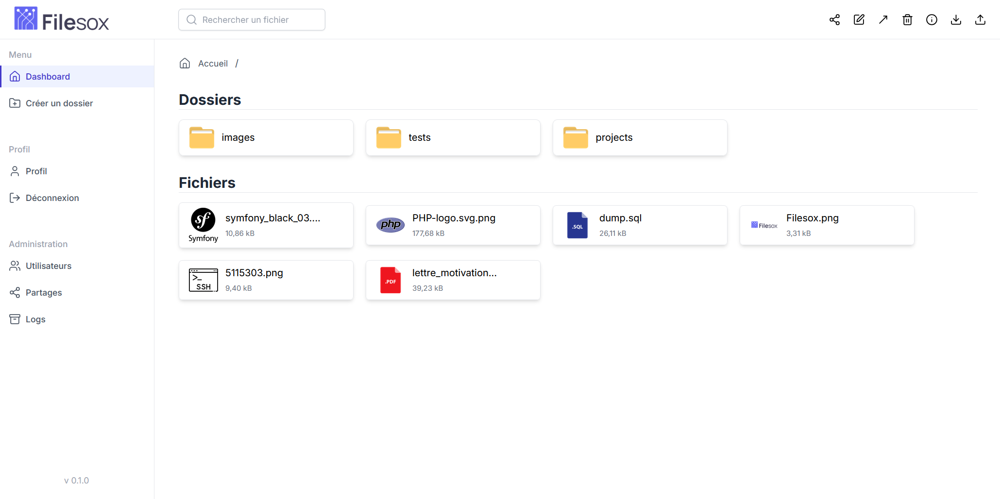

<div align="center">
<a href="https://github.com/TheoMeunier/Filesox">

</a>

<h2 align="center">Filesox</h3>
  <p align="center">
    <a href="https://github.com/TheoMeunier/Filesox/issues/new?labels=bug&template=bug-report---.md">Report Bug</a>
    ·
    <a href="https://github.com/TheoMeunier/Filesox/issues/new?labels=enhancement&template=feature-request---.md">Request Feature</a>
  </p>
</div>

## About The Project

FileManager S3 is a versatile file manager that offers a flexible storage solution, enabling the use of Amazon S3.
Featuring an intuitive user interface and robust administration panel, it aims to simplify file
management for businesses and developers.



## Getting Started

### Prerequisites

* nodejs lts
* java 21
* postgres 16

### Installation

1. Clone the repo
   ```sh
   git clone https://github.com/TheoMeunier/filesox.git
   ```
2. Configuring the `.env` file

3. Build front-end
   ```sh 
    cd front
    npm install
    npm run build
   ```
4. Build back-end
   ```sh
    ./gradlew :quarkusAppPartsBuild -Dquarkus.package.type=native -Dquarkus.native.container-build=false
   ```

#### Docker

1. Create a docker-compose file

```yml
services:
  front:
    image: ghcr.io/theomeunier/filesox/front:latest
    container_name: filesox_front
    restart: unless-stopped
    ports:
      - "80:80"
    networks:
      - app_network

  back:
    image: ghcr.io/theomeunier/filesox/api:latest
    container_name: filesox_api
    restart: unless-stopped
    ports:
      - "8080:8080"
    volumes:
      - ./certs:/work/certs
    networks:
      - app_network

networks:
  app_network:
    driver: bridge

```

### 2. Configure the `.env` file

#### 2.1 PostgreSQL Configuration:

- `QUARKUS_DATASOURCE_USERNAME` : The username of your PostgreSQL database
- `QUARKUS_DATASOURCE_PASSWORD` : The password of your PostgreSQL database
- `QUARKUS_DATASOURCE_JDBC_URL=jdbc:postgresql://[host][:port][/database]` : The URL of your PostgreSQL database

#### 2.2 S3 Configuration:

- `QUARKUS_S3_ENDPOINT_OVERRIDE` : Endpoint of your S3 provider
- `QUARKUS_S3_AWS_REGION` : The region of your S3 provider
- `QUARKUS_S3_AWS_CREDENTIALS_STATIC_PROVIDER_ACCESS_KEY_ID` : Access key of your S3 provider
- `QUARKUS_S3_AWS_CREDENTIALS_STATIC_PROVIDER_SECRET_ACCESS_KEY` : Secret key of your S3 provider

#### 2.3 Redis Configuration;

- `QUARKUS_REDIS_HOSTS=redis://[username:password@][host][:port][/database]` : The URL of your Redis database

### 3. Create keys for JWT token with `openssl`:

```bash
mkdir certs/ && cd certs

openssl genrsa -out rsaPrivateKey.pem 2048
openssl rsa -pubout -in rsaPrivateKey.pem -out publicKey.pem
openssl pkcs8 -topk8 -nocrypt -inform pem -in rsaPrivateKey.pem -outform pem -out privateKey.pem
```

#### Connect to the application

Your default admin credentials are:

- Email: `admin@filesox.fr`
- Password: `adminadmin`

It is strongly recommended that you change this password immediately after your first login for security reasons.

## Contributing

Contributions are what make the open source community such an amazing place to learn, inspire, and create. Any
contributions you make are **greatly appreciated**.

If you have a suggestion that would make this better, please fork the repo and create a pull request. You can also
simply open an issue with the tag "enhancement".
Don't forget to give the project a star! Thanks again!

1. Fork the Project
2. Create your Feature Branch (`git checkout -b feature/AmazingFeature`)
3. Commit your Changes (`git commit -m 'Add some AmazingFeature'`)
4. Push to the Branch (`git push origin feature/AmazingFeature`)
5. Open a Pull Request

## License

Distributed under the MIT License. See `LICENSE` for more information.